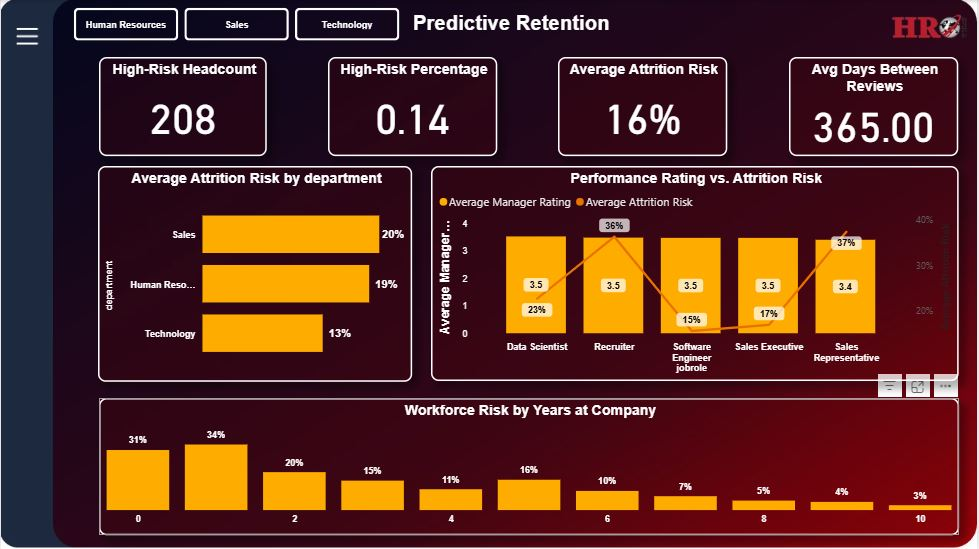
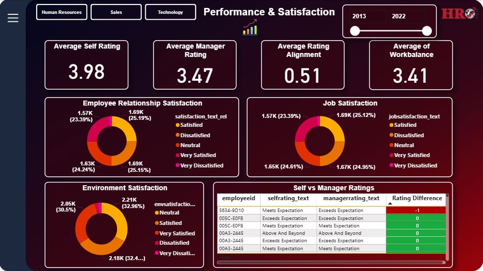
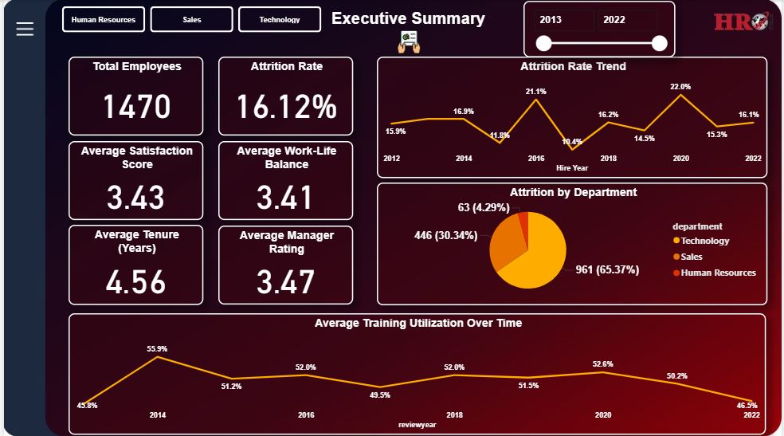

# HR Predictive Retention & Performance Insights

This project develops an advanced HR Analytics solution, transforming raw employee data into a comprehensive Star Schema to power an interactive dashboard and a Machine Learning model for predicting employee attrition risk. The goal is to provide HR leadership with actionable, forward-looking insights to improve employee retention, optimize performance management, and guide strategic organizational planning.

Understanding workforce behavior is essential for reducing turnover, improving employee experience, and enabling strategic HR planning.

This project analyzes HR data to uncover actionable insights related to:

* Employee demographics
* Performance trends
* Job satisfaction
* Training utilization
* Attrition (retention risk)

## Project Outcomes & Key Insights

This project delivers both historical analytical capabilities and future-facing predictions:

* **Interactive HR Dashboard (Power BI):** A multi-page visualization that tracks performance, satisfaction, operational efficiency, and highlights risk areas.
* **Predictive Model:** A highly accurate Random Forest Classifier trained to calculate an Attrition Risk Score for every active employee.
* **Written Report:** Final document detailing methodology, key findings (e.g., high-risk tenure groups), and strategic recommendations.

### Final Dashboard Visuals

**Figure 1: Predictive Retention**
This page, driven by the Machine Learning model, identifies the **208 High-Risk Employees** and pinpoints the critical **0-2 year tenure group** as having the highest risk.



**Figure 2: Performance & Satisfaction**
This view is crucial for operational health, highlighting the significant 0.51 gap in Average Rating Alignment (Self vs. Manager).



***

**Figure 3: Executive Summary**
A high-level overview of historical KPIs, including the 16.12% Attrition Rate and its annual trend since 2012.



---


## Dataset Overview
The project uses 5 CSV tables:

| File | Description | Rows |
|------|-------------|------|
| Employee.csv | Employee demographics & job info | 1470 |
| EducationLevel.csv | Education category mapping | 5 |
| PerformanceRating.csv | Historical performance reviews | 6709 |
| RatingLevel.csv | Performance level descriptions | 5 |
| SatisfiedLevel.csv | Satisfaction scale mapping | 5 |

---

## Project Architecture

```bash
HR_Data_Analysis_Project/
│
├── data/
│   ├── raw/           # Original untouched datasets
│   └── clean/         # Cleaned, Modeled & Final Export files for Power BI
│       ├── employee_master.csv        
│       ├── performance_fact.csv       
│       ├── ml_data_for_prediction.csv 
│       └── employee_predictions.csv   
│
├── scripts/
│   ├── data_cleaning_functions.py
│   ├── data_modeling.py               # (New Script for Star Schema Creation)
│   └── model_training.py              # (New Script for ML Workflow)
│
├── notebooks/
│   ├── 01_Data_Cleaning.ipynb
│   └── 02_KPI_Analysis.ipynb
│
├── models/            # Saved Machine Learning Model
│   └── random_forest_model.pkl
│
├── report/            
│   └── HR Analytics: Workforce Performance, Risk Assessment, and Strategic Recommendations.docx
│
├── README.md
└── requirements.txt
```
## Project Phases & Key Accomplishments

### Phase 1: Data Cleaning & Star Schema Modeling

* **ETL:** Loaded, cleaned, standardized, and merged raw data.
* **Modeling:** Created the **Star Schema** architecture:
    - **Dimension Table:** `employee_master.csv` (One row per employee).
    - **Fact Table:** `performance_fact.csv` (Multiple time-series rows per employee).
* **Feature Engineering (Advanced):** Added crucial time-series features to the Fact Table:
    - `previous_manager_rating:` Lagging feature to track performance trend.
    - `days_since_last_review:` Operational metric measuring management review cadence.

---
### Phase 2: KPI Development & Analysis
* **HR KPIs:** Developed measures for demographics, satisfaction, and historical attrition trends.

* **Operational KPIs:** Defined and calculated new operational metrics:
    * `Average Days Between Reviews`


### Phase 3: Data Visualization & Dashboard
* **Dashboard:** Finalized a professional, interactive, multi-page Power BI dashboard.
* **Predictive Layer:** Integrated the `employee_predictions.csv` file, linking the ML scores to the `employee_master` table.
* **Actionable Visuals:** Created visuals targeting the **208 High-Risk Employees** (employees with $\ge 80\%$ predicted attrition probability).


### Phase 4: Machine Learning Model
* **Data Prep:** Aggregated time-series data into `ml_data_for_prediction.csv` (one row per employee).

* **Modeling:** Trained and saved a Random Forest Classifier.

* **Performance:** Model achieved 99.5% accuracy on the test set.

* **Deployment:** Model output `employee_predictions.csv` was exported for immediate use in the Power BI dashboard.


### Tools & Libraries Used:

- Python (Pandas, NumPy)
- Machine Learning: Scikit-learn, Joblib
- Development: VS Code, Virtual Environment (.venv)
- Visualization: Power BI


## How to Run the Project
```bash
# Create a virtual environment
python -m venv .venv

# Activate environment
.\.venv\Scripts\activate

# Install dependencies
pip install -r requirements.txt

# Launch Jupyter
jupyter notebook
```